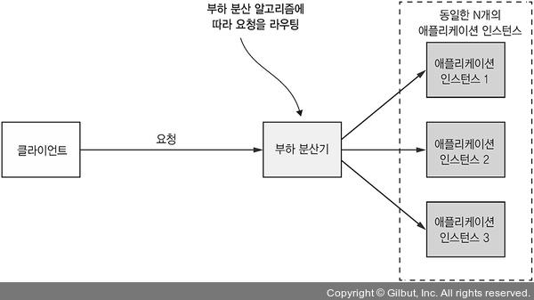
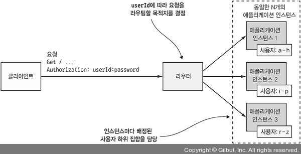
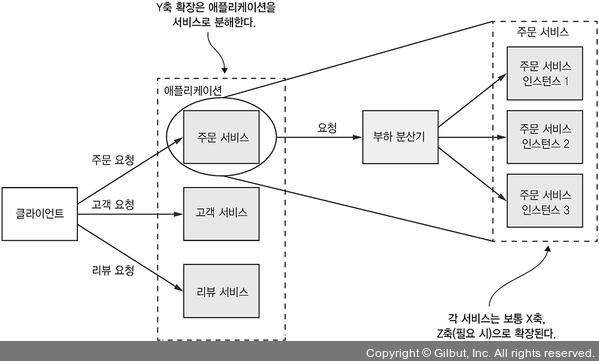
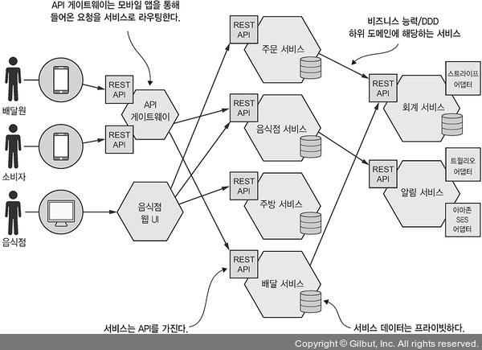
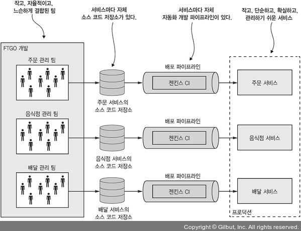

# 1. 모놀리식 지옥에서 벗어나라

---

[1.1 서서히 모놀리식 지옥에 빠져들다](https://www.notion.so/1-042c5bd75aa34a919412c3e8a6e69cd3)

[1.4 마이크로서비스 아키텍처가 답이다](https://www.notion.so/1-042c5bd75aa34a919412c3e8a6e69cd3)

[1.5 마이크로서비스 아키텍처의 장단점](https://www.notion.so/1-042c5bd75aa34a919412c3e8a6e69cd3)

[1.6 마이크로서비스 아키텍처 패턴 언어](https://www.notion.so/1-042c5bd75aa34a919412c3e8a6e69cd3)

[1.7 마이크로서비스 너머: 프로세스와 조직](https://www.notion.so/1-042c5bd75aa34a919412c3e8a6e69cd3)

## 1.1 서서히 모놀리식 지옥에 빠져들다

---

<aside>
🔥 `**모놀리식 아키텍처의 장점**`

- 개발이 간단
- 애플리케이션을 쉽게 변경 가능
- 테스트하기 쉽다
- 배포하기 쉬움
- 확장성이 높다
</aside>

> 하지만 시간이 지날수록 `개발`, `테스트`, `배포`, `확장`이 점점더 어려워 졌다
> 

<aside>
🔥 `**모놀리식 아키텍처의 단점**`

- 복잡성이 높음 : 개발자가 완전히 이해할 수 없을 정도로 양이 많음
- 기능구현 시간이 올라감
- 빌드시간이 오래 걸림
- 생산성이 떨어짐
- 확장하기 어렵다 : 모듈마다 최적의 리소스 요건이 맞지 않음
- 신뢰성이 부족
- 새로운 기술 스택을 적용하기 어려움
</aside>

## 1.4 마이크로서비스 아키텍처가 답이다

---


<aside>
🔥 `**애플리케이션은 X축, Y축, Z축 세 방향으로 확장 시킬수 있다.**`

- X축 확장 : 다중 인스턴스에 고루 요청 분산
- Z축 확장 : 요청 속성별 라우팅
- Y축 확장 : 기능에 따라 애플리케이션을 서비스로 분해
</aside>

### X축 확장 : 다중 인스턴스에 고루 요청 분산



> 일반적인 `모놀리식 애플리케이션`의 확장 수단
> 
- `애플리케이션 능력`과 `가용성`을 개선할 수 있다

---

### Z축 확장 : 요청 속성별 라우팅



> 인스턴스별로 `특정 데이터만 처리` 하도록 하는 방법
> 
- `라우터`는 요청의 속성에 알맞는 인스턴스로 요청을 라우팅
- `데이터 파티셔닝`이 쉬워서 속도나 데이터 볼륨 면에서 좋다.

---

### Y축 확장 : 기능에 따라 애플리케이션을 서비스로 분해



> `하나의 어플리케이션`을 여러 서비스로 기능 분해 하는 아키텍처
> 
- x축/ y축 확장 만으로는 복잡성을 해결하기 어렵다
- 복잡도 해결을 위한 기능 분할이 필요
    - 원래 `Monolithic`했던 서비스를 분리하는 것이다.
    

---

### ****1.4.2 마이크로서비스는 모듈성을 가지고 있다****

- `모듈성(modularity`)은 크고 복잡한 애플리케이션 개발시 꼭 필요한 특성

<aside>
🔥 `**모듈을 분리 하는 이유**`

- 규모가 방대하기 때문에
- 너무 복잡해서 개인이 전부 이해하고 개발할수 없어서
- 여러 사람이 이해하고 개발할 수 있게 애플리케이션을 여러 모듈로 분해
</aside>

> `MSA`는 서비스를 모듈성의 단위로 사용
> 
- 각각의 서비스는 `API`라는 경계선을 가져 다른 서비스의 크래스에 마음대로 들어올 수 없다.
    - 내부 클래스에 마음대로 들어올 수 없다.
- 서비스를 블록처럼 독립적으로 `배포`/`확장`할 수 있다.

---

### ****1.4.3 서비스마다 DB가 따로 있다.****

- `MSA`는 서로 느슨하게 결합되어 있고 오직 `API`를 통해 통신
- 개발 단계에서 다른 서비스 개발자와 일일이 협의하지 않고도 `담당한 서비스의 스키마`를 변경할 수 있다.
- 또한 서비스가 완전분리 되어 있기 때문에 DB가 `Lock`이나 `Blocking` 되는 일은 일어나지 않는다.

<aside>
🔥 걱정말자. 느슨하게 결합한다고 래리 앨리슨(Larry Ellison, 오라클 설립자 겸 CEO)이 벼락 부자가 될 일은 없다.

</aside>

---

### ****1.4.4 예제 마이크로서비스 아키텍처****

> `FTGO` 라는 애플리케이션을 MSA로 전환하는 과정을 살펴볼 것이다
> 
- 먼저 이 애플리케이션에 `Y축 확장`을 적용하면 어떻게 되는지 짚어보자.



- 위와 같이 `API 게이트웨이`는 소비자, 배달원의 앱이 접속하는 `Rest API`를 제공한다.
- 음식점은 `웹 UI`를 가지며, 주문 처리 할수 있도록함.

> `FTGO 애플리케이션은` 각각의 DB를 가지며, 다양한 백엔드 서비스로 구성
> 
- 주문 서비스
- 배달 서비스
- 음식점 서비스
- 주방 서비스
- 회계 서비스

<aside>
🔥 각 서비스를 독립적으로 `개발`, `테스트`, `배포`, `확장`할 수 있다

- 개발자가 타 서비스의 `API를 우회`하거나 그 내부 요소에 직접 접근할 수 없어 `모듈성을 유지할 수 있다.`
</aside>

---

### 1.4.5 마이크로서비스 아키텍처와 SOA

<aside>
🤔 **`MSA는 SOA와 다르점이 있을까?`**

> 다들 전혀 새로운것이 아닌 같은거다 라고 함
> 
- 두 아키텍처 모두 `애플리케이션`을 `여러 서비스로 구성`하는 아키텍처 스타일이다.
- 조금더 깊이 들어가면 `근본적으로` 다른 차이점이 있다
</aside>

[SOA 와 MSA 비교](https://www.notion.so/16aa1daeec664c5893cc34d8306758fd)

## 1.5  MSA 의 장점

---

- 크고 복잡한 `애플리케이션`을 `CI`/`CD` 할 수 있습니다.
- **서비스별 규모가 작아 관리가 쉽다.**
- **서비스를 독립적으로 배포/확장할 수 있다.**
- **서비스별로 팀이 자유롭게 움직일 수 있다.**
- **결합 격리가 잘 된다.**
- **새로운 기술을 도입/실험하기 쉽다.**

### 크고 복잡한 애플리케이션을 CI/CD할 수 있다.

---

> MSA 구축시 크고 복잡한 애플리케이션을 CI/CD할 수 있습니다.
> 
- 기존의 `Monolith Application`은 `테스트에 몇일`, 배포에도 `몇시간씩` 걸릴 수도 있기 때문에 CI/CD를 자주 하긴 어려웠다.

<aside>
🤔 **CI/CD는 비지니스 측면에서 이점도 많다.**

- 제품의 릴리스 시간 단축
- 고객의 피드백에 대한 빠른 대응
- 급한 불을 끄는데 급급한게 아니라서 Application의 품질을 높이는데에 더 많은 시간 투자 가능
- 확실한 수준의 서비스 제공
</aside>

> MSA에선 다음 세가지 방법으로 CI/CD를 지킨다.
> 

### 테스트성

- `CI` / `CD`를 하려면 자동화 테스트가 꼭 필요하다.
- `애플리케이션` 크기가 작아 테스트를 자동화 시키기 쉽다
- 애플리케이션 버그도 적은편

### 배포성

- `마이크로서비스는` 독립적으로 배포할수 있음
- 담당자가 자기인 `서비스는` 굳이 다른 개발자와 협력할 필요가 없다
- 프로덕션에 변경부분을 릴리즈 하기 쉽다

### 자율성, 느슨한 결합

- `큰 팀이 아닌 작은 팀`으로 각각 다른 기술로 조직을 구성할 수 있음
- 팀별로 자신이 속한 서비스만 `개발`/`배포`하는 업무만 담당해 개발 속도 향상

---

### 서비스가 작아 관리하기 용이하다

- 마이크로서비스는 비교적 크기가 작아 개발자가 코드를 이해하기 쉽다

  

- `큰 모놀리식`보다는 각 서비스를 `빌드` 하는 시간이 훨씬 빨라 배포하는 과정이 빠르다.

### 서비스를 독립적으로 배포/확장할 수 있다

- 독립적으로 `x축/z축` 확장을 할 수 있어 서비스별로 `최적화된 리소스` 요건에 맞춰 배포할수 있다

> 예를 들어 `CPU` 작업이 많은 서비스는 `고사양의 CPU를 장착한 서버에`, `메모리`가 많이 필요한 서비스는 `메모리가 많은 서버에 배포`할 수 있다.
> 

<aside>
🔥 한곳에서 배포해 서버의 성능을 올리기 위해 `서버 전체의 성능`을 높여야 하는 `Monolithic Architecture`보다 확장성이 높음

</aside>

### 결함 격리가 잘된다

> MSA는 결함 격리가 잘된다.
> 
- 한곳에서 `결함발생시` 발생한 곳에서만 영향을 받아, 다른곳은 `정상작동` 한다
- `Monolithic Architecture` 는 결함 발생시 전체 서비스에 영향을 준다

### 신기술을 시험/도입하기 쉽다

> `특정 기술 스택`을 연구하느라 오랜 시간을 소비할 필요가 없다.
> 
- 서비스 개발시 그 서비스에 알맞는 `언어`와 `프레임 워크`를 자유롭게 선택 가능
- 규모가 작기 때문에 서비스를 더 좋은 기술로 `다시 작성하기 쉽다`
- `Monolithic Architecture`는 초반에 선택한 기술로 제약을 받는다

## 1.5.2 MSA 단점

> 세상에 만병통치약은 없듯이, MSA에도 많은 단점이 있다.
> 

<aside>
🔥 `단점`

- 딱 맞는 서비스를 찾기 어렵다
- 분산 시스템은 너무 복잡해 `개발`, `테스트`, `배포`가 어렵다
- 여러 서비스에 걸친 기능을 배포할 때에는 잘 조정해야 한다
- 마이크로서비스 아키텍처 도입 시점을 `결정하기 어려움`
</aside>

### 딱 맞는 서비스를 찾기 쉽지 않다

> `MSA`에 딱 맞는 구체적으로 `적립된 알고리즘`은 없다
> 
- 만약 잘못 분해할 경우, `MSA`와 `Monolith`의 단점만 모아둔 `Distributed Monolith`를 구축할수도 있다.

### 분산 시스템은 복잡하다

> `분산 시스템` 이라는 또 다른 `복잡성`은 개발자가 감당해야 한다.
> 
- 서비스 간 통신에 필수적인 `IPC` 역시 단순 `메서드 호출`보다 복잡하다
- `사용 불능` 또는 `latency`가 긴 원격 서비스,  `부분 실패한 서비스`를 처리할 수 있게 설계해야 한다.

<aside>
🔥  **`MSA가 어려운 이유`**

- 여러 DB에서 일어나는 트랜잭션을 구현하는 일이 어렵다
    
    > `SAGA` 라는 패턴을 사용해 트랜잭션의 원자성을 유지 (4장)
    > 
- 단순 쿼리로는 여러 서비스에 있는 데이터를 조회할수 없다
    
    > API를 조합하거나, `CQRS` 뷰를 이용해야 한다 (7장)
    > 
- 우리가 사용하는 IDE역시 `Monolithic Architecture` 를 초점을 두어 MSA는 지원 안함
- 여러 서비스가 연관된 테스트를 자동화 하는건 쉽지 않다
</aside>

> 따라서 뛰어난 개발능력을 소유한 개발자가 필요
> 

<aside>
🔥 `MSA는 운영 복잡도 역시 가중시킨다.`

> 여러 `인스턴스`에 `애플리케이션`이 떠있기 때문에 관리해줄 사람이 필요하다.
> 
- `Netflix Spinnaker` : 배포 자동화 툴
- `Pivotal Cloud Foundry` / `Red Hat OpenShift` : 바로쓸 수 있는 `PasS`
- `Docker Swarm`, `Kubernetes` : 도커 오케스트레이션 플랫폼
</aside>

### 여러 서비스에 걸친 공통 기능은 배포할 때 잘 살펴야 한다

> 여러 서비스에 걸친 기능을 배포할 때는 팀과의 협의후 신중하게 결정
> 
- 서비스 간 `디펜던시`에 따라 서비스 배포 계획을 빈틈없이 수립

### 도입 시기를 결정하기 어렵다

> 어느 시점에 `MSA`를 도입할지 결정하는 일은 만만치 않다.
> 

- 초기에 MSA를 사용하면 개발 속도가 더딜 수 있고 신속하게 `이터레이션(반복)` 하기 어렵다
- 애플리케이션을 빠르게 발전시켜야 하는 `스타트업 회사`는 `Monolithic`으로 시작 하는것이 좋다

> 그런 다음 `복잡성을 다루는 문제`가 중요해지는 시점에 애플리케이션을 분리 하는게 좋다
> 

<aside>
🔥 `예외 서비스`

> 일반 소비자를 상대하는 웹 어플리케이션이나 `SaaS`처럼 복잡한 애플리케이션은 `MSA`가 잘 맞다
> 
- eBay, Amazon, Groupon, Gilt도 `Monolithic`에서 `MSA`로 바뀜
</aside>

> 우리는 `MSA`도입에 따른 다양한 설계/ 아키텍처 이슈를 해결해야 한다
> 
- 그중 상당수는 솔루션이 한두 가지가 아님
- 각자 나름대로의 `트레이드오프(trade-off)` 가 있다
- 그래서 좀 더 좋은 선택을 하기위해 `마이크로서비스 아키텍처 패턴 언어`를 만들었다

## 1.6 마이크로 서비스 아키텍처 패턴 언어

### 1.6.1 마이크로서비스 아키텍처도 만병통치약은 아니다

> 1986년 `Frederick Brooks`은 소프트웨어 공학에 만병통치약 따위는 없다고 잘라 말함
> 
- 생산성을 갑자기 10배로 만들어주는 기법/ 기술 같은건 없다

> 어떤 기술이 `엉망인지`/ `최적인지를` 논하는 논쟁은 아직도 진행 중 이다.
> 

Neal Ford가 처음 쓴 말(The suck/rock dichotomy)로, 예를 들면 다음과 같다.

- 동기/리액티브
- 객체 지향/함수형
- 자바 대 자바스크립트
- Rest/메세징

> 현실은 그리 간단하지 않음
> 
- 어떤 기술을 택하더라도 `Gartner hype cycle`의 전철을 밟게 된다

> `Gartner hype cycle`이란 미국의 정보 기술 연구 및 자문 회사인 `Gartner`에서 만든 **기술의 성숙도를 표현하는 시각 도구**이다.
> 
> 
> 기술들은 다음 5단계로 이루어진다.
> 
> [Gartner hype cycle](https://www.notion.so/3e2d9c927ece47e99c9ac0e23d448ead)
> 
- 결국 기술들은 관심을 받아 `기대의 정점` 상태를 거쳐 `환멸`이라는 구렁텅이로 빠지게 되고, 결국 생산성이 정체되는 5단계에 이르러서야 기술의 단점, `Trade-off`에 대해 이해할 수 있다.

> 자신의 감정을 극복한 상태에서 기술을 논할 방법을 강구해야 한다
> 
- 이것이 `패턴 포맷` 으로 `기술`을 `객관적`으로 기술 하는것

### 1.6.2 패턴 및 패턴 언어

> `패턴`은 특정한 상황에서 발생한 문제에 대한 재사용 가능한 해법
> 

<aside>
🤔 **`패턴 언어?`**

- **특정 영역 내부에서 문제를 연결하는 연관 패턴의 집합**
</aside>

예시를 들자면 `마이너스 통장 정책을` 지원해야 하는 `뱅킹 애플리케이션`을 구축한다 해보자

> `계좌 잔고 한도` 및 초과 인`출된 계좌`에 부과되는 수수료는 은행마다 정책이 다르다
> 
- ****`Strategy Pattern`****으로 해결 가능
    
    > 이 문제의 솔루션은 3가지로 구성 가능
    > 
    > - 초과 인출 알고리즘을 캡슐화한 전략 인터페이스 `Overdraft`
    >     - **`행위를 클래스로 캡슐화해`** 동적으로 행위를 자유롭게 바꿀 수 있게 해주는 패턴
    > - 하나 이상의 전략 Concrete 클래스 (각각 특정 맥락을 표현함)
    >     - 추상 클래스가 아닌 클래스는 모두 `concrete class`라고 할 수 있습니다
    >         - 전략 클래스란 **전략 인터페이스를 구현한 클래스**를 의미한다.
    > - 알고리즘을 사용하는 Account 클래스

- 전략 패턴은 객체 지향 디자인 패턴이므로 솔루션의 Element는 클래스다

> 패턴은 자신이 적용되는 맥락을 반드시 기술해야 한다
> 
- 넷플릭스 규모의 회사가 사용했던 패턴이 소수의 사용자만 쓰는 서비스에도 잘 통한다는 보장은 없다
- 자신들의 상황을 잘 이해하고 사용하고, 솔루션 측면도 함께 기술을 강제한다는 점에서 호용성이 뛰어나다.

<aside>
🤔 `**상용 패턴의 구조는 3부분으로 구성**`

- 강제 조항
- 결과 맥락
- 연관 패턴
</aside>

### 강제 조항: 문제 해결을 위해 반드시 처리해야 할 이슈

> 주어진 맥락에서 문제를 해결하고자 할 때 반드시 처리 해야할 조항
> 
- 어느 조항이 더 중요한지는 맥락에따라 달라 우선순위를 정해야 한다.

<aside>
🤔 `이슈`

- 코드는 이해하기 쉬워야 하며 성능도 우수해야 한다
- `Reactice 스타일`로 작성한 코드는 동기 코드보다 우수할지 모르지만 개발자가 이해하기는 `상대적으로 어렵다`
</aside>

### 결과 맥락: 패턴 적용 결과

> **패턴을 적용한 결과를 나타내는 영역**으로, 3가지로 분류된다.
> 
- **`장점`:** 해결된 강제 조항을 포함해서, 해당 디자인 패턴을 사용함으로써 얻는 장점
- **`단점`:** 해결되지 않은 강제 조항을 포함해서, 해당 디자인 패턴을 사용함으로써 갖게되는 단점
- **`문제점`:** 해당 패턴을 적용함으로써 새롭게 생기는 문제점

### 연관 패턴: 다섯 가지 관계 유형

> `한 패턴`과 `다른 패턴`의 관계를 기술하는 영역은 5가지가 있다.
> 

- `선행자`: 이 패턴을 넣게된 선행 패턴.
    - `MSA`는 `MA`을 제외한 나머지 패턴들의 선행자다
- `후행자`: 이 패턴으로 야기된 이슈를 해결하는 패턴
    - `MSA`를 이야기 하자면 `SAGA 패턴`, `서비스 디스커버리 패턴이` 있다.
- `대안`:  이 패턴의 대체 솔루션을 제공하는 패턴
    - `MSA`는 `MA`를 대신할 수 있는 아키텍처 수단 이다. (둘중 하나를 선택하면 된다)
- `일반화`: 문제를 해결 하는 일반적인 솔류션에 해당하는 패턴
- `세분화`: 특정 패턴을 더 세부적으로 나타낸 형태

> 특정 영역의 문제를 해결하는 패턴끼리 묶어 명시적으로 기술하면 어떤 패턴을 사용하는게 좋을지 효과적으로 나타낼 수 있다.
> 


패턴 사이의 다양한 유형의 관계를 시각화한 그림

> 패턴간 관계 역시 몇 가지 유형이 있다.
> 
- 선행자 ~ 후행자 관계를 표현
- 같은 문제를 다른 방법으로 해결하는 패턴
- 한 패턴이 다른 패턴을 구체화한 패턴임을 표시
- 특정 영역의 문제에 적용되는 패턴

## 1.6.3 마이크로 서비스 아키텍처 언어 개요

> MSA 패턴 언어는 **전체 `Application`을 `MSA`로 구성할 때 유용한 패턴들의 모음**이다.
> 

아키텍쳐의 장단점을 기술할 수 있기 때문에, MSA를 사용하는게 적합한지 확인할 수 있고 패턴 언어를 통해 다양한 이슈들을 해결할 수 있다.


왼쪽은 애플리케이션 아키텍처 패턴, 나머지 그룹은 마이크로서비스 아키텍처 패턴의 문제를 해결하는 패턴

> 패턴은 다시 세 계층으로 분리된다.
> 
- `인프라 패턴`: 주로 개발 영역 밖의 문제를 해결
- `애플리케이션 인프라`: 개발에도 영향을 미치는 인프라 문제를 해결
- `애플리케이션 패턴`: 개발자가 맞닥뜨리는 문제를 해결

> 패턴은 해결하려는 문제의 종류별로 묶을 수 있다.
> 

### 애플리케이션을 여러 서비스로 분해하는 패턴

> 한 시스템을 여러 서비스로 분해하는 방법을 결정하는 것이 진짜 기술
> 
- 이것을 도와주는 패턴이 있다.


비즈니스 능력에 따라 서비스를 구성하는 방법, DDD 하위 도메인에 따라 서비스를 구성하는 방법

<aside>
🤔 **`통신패턴`**

> `분산 시스템` 이기 때문에 프로세스 간 통신이 아주 중요
> 
- 그러므로 서비스 상호간, 외부 세계와 어떻게 통신하면 좋을지 다양한 의사 결정 해야 한다


### 총 5개로 분리 가능

- `통신 스타일`: 어떤 종류의 `IPC`를 사용 하는가
- `디스커버리`: 서비스 클라이언트는 서비스 인스턴스의 IP 주소를 어떻게 가져오는가
- `신뢰성`: 서비스 불능 시 서비스 간 통신의 신뢰성은 어떻게 보장되는가
- `트랜잭셔널 메시징`: DB 트랜잭션에 메시지를 송신하고 미벤트를 발행하는 행위는 어떻게 통합?
- `외부 API`: 애플리케이션과 클라이언트는 서비스와 어떻게 통신 하는가
</aside>

## ****DB의 분산으로 인한 문제점****

---

> `MSA`는 각각의 `DB`를 가지고 느슨한 결합을 유지한다고 했는데, DB가 모두 따로 있으면 몇가지 문제가 있다.****
> 

### 트랜잭션 관리를 위한 데이터 일관성 패턴

- 기존의 분산 트랜잭션은 `MSA`에서 부적합 하다.
    - `SAGA 패턴`으로 데이터의 일관성을 유지
        
        
        
        서비스 마다 자체 DB를 갖고 있으므로 SAGA Pattern에 따라 서비스간 데이터 일관성을 유지 해야 한다.
        
    

### 데이터 쿼리 패턴

- 서비스마다 DB를 두면 데이터 `Join할 때도 문제다`
    - 서비스 데이터는 오직 API를 통해 접근할 수 있어 분산 쿼리를 사용할 수 없다.


서비스별로 DB를 가지고 있어 두가지 쿼리 패턴중 하나를 사용해 여러 서비스에 흩어진 데이터를 조회

<aside>
🤔 `API 조합 패턴`(Composition Pattern)

- 하나 이상의 서비스를 호풀해 그 결과를 조합 하고

### `CQRS`

- 하나 이상의 데이터 레플리카를 유지해서 쉽게 쿼리하는 방식
</aside>

### ****서비스 배포 배턴****

- `애플리케이션` 배포는 `MA` 에서도 어려운 작업 이었지만 `MSA` 보다 훨씬 직관적이다
    - `MSA`는 다양한 언어와 프레임워크로 구현된 수십개가 넘는 서비스로 이루어져 배포 작업이 훨씬 어렵다
    - `MA` 에서는 그냥 JAR 파일 빌드 해서 수도 배포 했다.
        
        > 이런식으론 `MSA` 가 오래 버틸수 없다
        > 
    - MSA를 배포 하기 위해선 매우 정교하고 고도화된 배포 인프라가 필요하다.
    
    
    
    자세한 내용은 12장에서
    

### 관측성 패턴: 애플리케이션 동작 파악

> 관리자의 주 업무는 애플리케이션의 요청 실패, 높은 지연시간이 발생했을 때 이를 진단하고 조치하는 일 이다.
> 
- `MA`는 운영은 똑같지만 요청이 `비교적 단순`하고 알기 쉬워 `트러블 슈팅`이 쉽고 편하다.

- 요청이 `분산을 위해 라우팅` 되고, 애플리케이션은 `DB에 쿼리`를 날려 결과를 반환한다
    - 클라이언트의 요청은 그냥 로그 보면 잘 나옴
    
    > `MSA`는 요청이 여러 서비스를 거쳐 반환되 로그 파일 하나로는 원인 까다로움
    > 
    
- 관측을 설계 하려면 6가지 패턴이 필요하다

<aside>
🤔 `**관측 설계 패턴**`

- `헬스 체크 API`:  서비스 상태를 반환하는 endpoiont를 표출 시킨다
- `로그 수집`: 서비스 내역을 기록 하고 로깅 서버에 로그를 출력해 검색/경고 기능 제공
- `분산 추적`: 각 요청마다 ID를 부여해 서비스를 통과하는 과정을 추적
- `예외 추적`: 예외가 발생하면 예외 추적 서비스에 보고 한다
- `애플리케이션 지표`: 카운터, 게이지 등의 지표를 측정해 특정 서버에 표출
- `감사 로깅`: 사용자가 한 일을 기록
</aside>

### 서비스 테스트 자동화 패턴

> `MSA`는 단위 서비스 크기가 비교적 작아 테스트가 쉽지만, 여러 서비스들과 조화롭게 작동 하는지 테스트 해야 한다
> 
- end-to-end 같이 테스트가 느리고 복잡한 것은 피하는것이 좋다
    
    > `E2E test`란 GUI를 통해 실제 사용자처럼 테스트를 진행하는 것이다.
    > 
    
- `컨슈머 주도 계약 테스트`: 클라이언트가 의도한 대로 서비스가 동작하는지 확인합니다.
- `컨슈머 쪽 계약 테스트`: 클라이언트와 서비스가 상호 통신 가능한지 확인
- `서비스 컴포넌트 테스트`: 서비스를 따로따로 테스트한다

### ****Cross-Cutting 처리 패턴****

> `횡단 관심사(Cross-Cutting concern)`란 `AOP`에서 공통된 코드들을 추출하는 것 처럼 전 서비스에 걸친 공통된 부분을 의미한다.
> 
- MSA는 위에서 나온 여러 패턴들 외에도 여러 서비스들이 반드시 구현해야 할 패턴들이 많다.

각각의 마이크로서비스마다 이런 `Cross-Cutting`을 처리하는건 시간이 오래 걸리기 때문에 **`Cross-Cutting을 처리하는 서비스`**를 두고, 그 서비스에서 **`Microservice Chassis`를 적용해서 구축**하는게 바람직하다.

### 보안 패턴

> `MSA`는 주로 `API GateWay`가 `인증/인가` 역할을 담당해 서비스에 관련 정보를 전달 합니다.
> 
- 일반적으로는 `JWT`같은 `Access Token` 패턴을 적용 하는 것이다

---

## 1.7 마이크로서비스 너머: 프로세스와 조직

> `MSA`에 대한 설명은 끝났고 `프로세스`에 대해 알아보자
> 
- 큰 프로젝트는 `MSA`가 정답이다
    - 제대로된 조직, 올바른 `개발/배포 프로세스`도 수립되어야 소프트웨어 개발에 성공할 수 있다.


위 그림처럼 DevOps 기술과, CI/CD를 가용 해야 한다.

### 1.7.1 소프트웨어 개발/전달 조직

> 크기가 N인 팀의 소통 오버헤드는 `O(N²)`으로 증가 한다
> 
- 매일 아침 팀원 20명과 `스탠드업 미팅`을 한다 치면 운영 효율이 떨어진다.

- 비즈니스 관점에서 팀의 목적은 **`어떤 기능이나 비지니스 능력을 지닌 서비스`를 개발하고 운영**하는 것이다.
- 한 팀에서 모든걸 처리할 수 있으면 서비스를 독자적으로 `개발`, `테스트`, `배포`할 수 있다.

<aside>
🤔 **`역 콘웨이 전략(reverse Conway maneuver)`**

> 애플리케이션 아키텍처는 그것을 개발하는 조직의 구조를 그대로 반영한다는 뜻이다.
> 

```markdown
시스템을 설계하는 조직은 그들이 소통하는 구조를 그대로 옮겨 놓은 듯한 결과물을 낼 수밖에 없는 한계가 있다

- 멜빈 콘웨이(Melvin Conway)
```

- 이 법칙을 역 이용해 조직의 구조가 `MSA`에 고스란히 반영되도럭 설계해야 한다.
    - 이렇게 하면 `개발 팀`과 `서비스`를 느슨하게 결합시킬 수 있다.
</aside>

- 거대한 한 팀보다는 작은 여러 팀의 움직임이 훨씬 빠르다.
    - `MSA`는 팀이 자율적으로 움직이게 만든는 핵심 역할을 담당
- `Service Layer Agreement` 를 충족하지 못한 서비스는 어느 팀과 연락 해야 할지도 분명해진다.

<aside>
🔥 `장점`

- 개발 조직도 확장성이 좋아진다.
    - 팀을 키울수 있고, 어떤 팀 하나가 너무 커지면 연관된 서비스로 다시 팀을 나누면 된다.
- 팀이 서로 느슨하게 결합되어 대규모 팀의 소통 오버헤드가 발생할 일은 없다.
- 생산성에 아무런 영향을 끼치지 않고 인원을 보강할 수 있다.
</aside>

### 1.7.2 소프트웨어 개발/ 전달 프로세스

> `WaterFall` 개발 프로세스로 `MSA`를 구축 하는 건 프로젝트를 말아먹는 일이다.
> 

<aside>
🤔 `WaterFall` 개발 프로세스란?


> 폭포수처럼 각 단계별로 순차적인 진행
> 
- 5가지 순서로 이루어져 있다
    1. 요구사항 분석
    2. 설계
    3. 구현
    4. 검증
    5. 유지보수
- 이러한 `WaterFall` 방법에는 장단점이 명확하다

### 장점

- 오래되어서 자료가 풍부하다.
- 각 과정을 이해하기 쉽다.
- 결과물을 관리하기 쉽다.

### **단점**

- 각 관계가 수직적인 관계를 가져서 각 단계를 병행할 수 없다.
- 오류에 대한 즉각적인 피드백이 힘들다.
- 개발이 완료되기 전 사용자의 피드백을 담아내기 힘들다.
</aside>

- 애자일 개발 프로세스를 도입하고 `Scrum`, `Kanban` 등을 실천해야 하고, `CI/CD`를 도입해야 한다.

<aside>
🤔 `**애자일 이란?**`

> 개발 철학이라 100% 정답이 없다.
> 
- **`변화를 수용`**하고 협업과 제품의 출시를 강조하는 **`반복적 개발 기법`**으로, 문서화보단 **코드나 소프트웨어 자체를 중요시 한다.**
- 개발 도중 요구사항의 변화는 불가피하기 때문에 변화를 피하는게 아니라 변화에 대응을 목적으로 한다.
    - 기존의 `WaterFall` 방법은 설계 기간이 길어 재작업까지 오래 걸리기 때문에 변화에 대응하기 힘들다
    

### 애자일 소프트웨어 개발 선언

- 우리는 소프트웨어를 개발하고, 또 다른 사람의 개발을 도와주며 소프트웨어 개발의 더 나은 방법을 찾고 있다.
    1. 공정과 도구보다 개인과 상호작용
    2. 포괄적인 문저보다 작동하는 소프트웨어
    3. 계약 협상보다 고객과의 협력
    4. 계획을 따르기보다 변화에 대응

위 4가지를 가치 있게 여긴다. 이 말은, 왼쪽에 있는 것들도 가치가 있지만, 우리는 오른쪽에 있는 것들에 더 높은 가치를 둔다는 것이다.

### 애자일 12가지 원칙

1. 초기부터 지속적으로 고객 만족
    
    > 우리의 최우선 순위는 `가치(value)` 있는 소프트웨어를 초기부터 지속적으로 `제공(배포)`함으로써 고객의 만족 시키는것
    > 
    
    
    
2. 요구사항 변경 수용
    
    > 개발 후반부에 변화하는 요구 사항의 수용을 환영합니다. Agile 프로세스는 변화를 수용하며 고객의 경쟁력을 돕습니다.
    > 
    
    
    
    쏜 곳으로 정확히 날아가는것도 중요하지만, 움직이는 사물(고객/시장)을 맞추기 위해서는 변화에 대응 할 수 있어야 합니다.
    
3. 짧은 배포 간격
    
    > 소프트웨어를 짧은 주기로 동작하는 소프트웨어를 배포하되 더 짧은 주기를 선호합니다.
    > 
    
    
    
4. 기획자/현업과 개발자는 함께 일하기
    
    > 비즈니스 담당자와 개발자는 프로젝트 전체 기간동안 매일 함께 일해야합니다.
    > 
5. 동기부여된 팀원들로 프로젝트팀 만들기
6. 얼굴보고 대화하기
    
    > 개발팀에서 가장 효율적이고 효과적인 방법은 대면 대화 입니다.
    > 
7. 동작되는 소프트웨어로 진도 측정
    
    > 작동하는 소프트웨어가 진척의 주요 척도입니다.
    > 
    
    
    
8. 지속 가능한 개발 속도 유지
    
    > 스폰서, 개발자 및 사용자는 일정하게 일정한 속도를 유지할 수 있어야합니다.
    > 
    
    
    
    Agile은 프로젝트 초반부터 결과물을 내야하므로 초반에 더 힘이 듭니다. 하지만 지속적인 성과를 내기에 효과적입니다.
    
9. 좋은 기술, 설계에 관심
    
    > 우수한 기술과 우수한 디자인에 대한 지속적인 관심은 `민첩성(agility)`을 향상시킵니다.
    > 
10. 단순성
    
    > • 단순성(수행되지 않은 작업량을 최대화하는 기술)은 필수적입니다.
    > 
11. 자기 조직화 팀
    
    > 최고의 아키텍처, 요구 사항 및 디자인은 `Self-Organization Team` 에서 나옵니다.
    > 
12. 정기적으로 효율성 제고
    
    > 팀은 정기적으로보다 효과적인 방법을 적용하고, 그에 따라 행동을 조율하고 조정합니다.
    > 

- 애자일 방법론은 다음과 같은 개발 프로세스를 반복 한다
    1. **`계획`:** 고객과 사용자가 원하는 바를 파악해서 타당성을 검사하고, 명세서를 작성하고, 문제 영역을 이해하는 단계
    2. **`설계`:** 계획에 맞게 소프트웨어를 설계하고 디자인 추가/수정을 한다.
    3. **`개발`:** 설계에서 만들어진 명세서를 기반으로 코딩, 디버깅, 테스팅을 한다.
    4. **`테스트`:** 오류를 발견하고 수정하는 단계
    5. **`검토`:** 결과물과 기획에 따라 수정할 부분을 제시하는 단계

### **장점**

- 계획에 걸리는 시간을 최소화 할 수 있다.
- 점진적인 테스트가 가능하다.
- 수정과 변경에 유연하다.
- 프로토타입 모델을 빠르게 출시할 수 있다.
- 빠르게 개발할 수 있다.

### **단점**

- 계획이 부족할 수 있어서 반복적인 수정이 많다.
- 요구사항이 크게 변경되면 모델이 무너질 수 있다.
- 팀 중심이기 때문에 회의가 많을 수 있다.
- 속도는 빠르지만, 부족한 기능들에 대한 대처가 필요하다.
- 계획이 확정되지 않으면 개발할 때 이해하지 못했을 수 있다.
</aside>

- CI의 핵심은 소프트웨어를 언제라도 릴리즈할 수 있는 능력이다.
    - 자동화 테스트등 높은 수준의 자동화는 필수
- CD는 릴리즈 가능한 코드를 프로덕션에 자동 배포하는 것 이다.
    - 하루에도 여러번씩 배포가 가능하고, 사고는 거의 없고 발생해도 빠르게 복구할 수 있다.
    

<aside>
🔥 **중단없이 재빠르게 움직여라**

> 지속적 전달/배포의 목표는 신속하고 확실하게 소프트웨어를 전달하는 것
> 

- **`배포 빈도(Deployment Frequency):`** 소프트웨어를 얼마나 자주 배포하는가?
- **`리드 타임(Lead Time):`** 개발자가 변경 사항을 파악한 후 배포까지 걸린 시간
- **`평균 복구 시간(Mean Time To Recover):`** 프로덕션의 복구에 걸린 시간
- **`변경분 실패율(Change Failure Rate):`** 프로덕션에 문제를 일으킨 변경 사항의 비율
</aside>