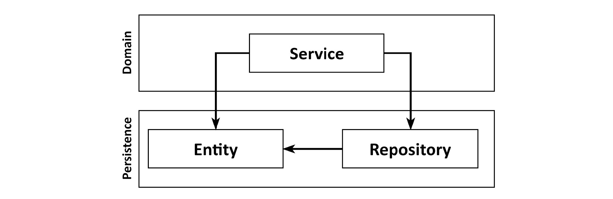
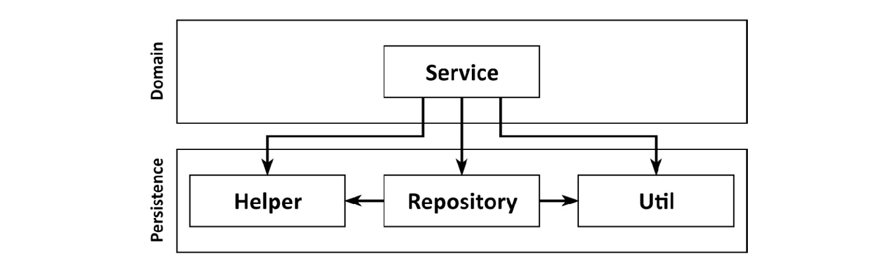
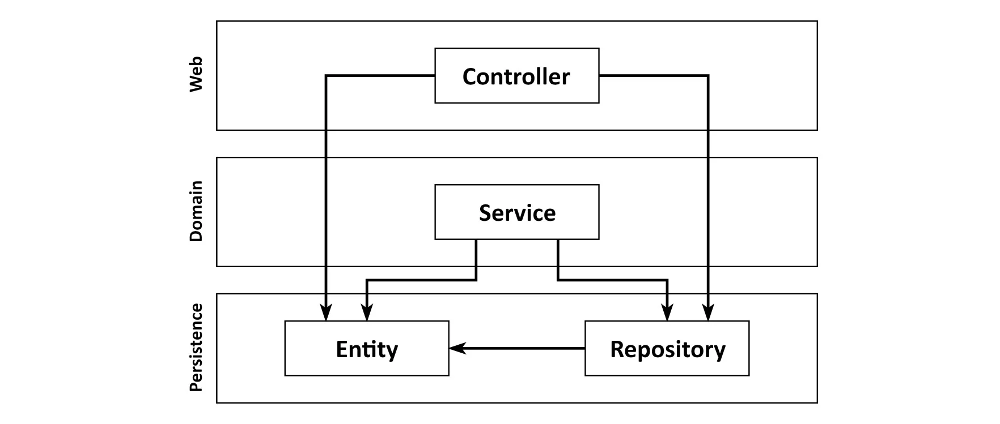
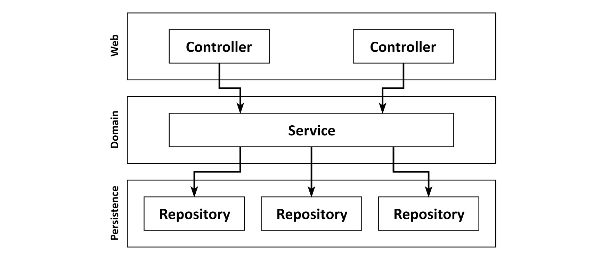

# 1.계층형 아키텍처의 문제는 무엇일까?

---

일반적인 3게층 아키텍처를 표현한 그림이다.

맨 위의 `웹` 계층에서 요청을 받아 `도메인` 혹은 `비즈니스` 계층이 있는 서비스로 요청을 보낸다. 도메인 엔티티의 현재 상태를 조회하거나 변경하기 위해 `영속성` 계층의 컴포넌트르 호출한다.

### 계층형 아키텍처의 문제점?

---

> 나쁜 습관들이 스며들기 쉽고 시간이 지날수록 소프트웨어를 점점 더 변경하기 어렵게 만드는 수많은 허점을 노출한다.
> 

## 계층형 아키텍처는 데이터베이스 주도 설계를 유도한다

---

> 전통적인 계츨형 아키텍처의 토대는 데이터베이스
> 

`웹` 계층은 `도메인` 계층에 의존하고 `도메인` 계층은 `영속성` 계층에 의존하기 떄문에 자연스레 데이터베이스에 의존하게 된다

`DB erd`, `DB Schema` 를 먼저 작성하고 이를 토대로 도메인 로직(Entity)를 구현한다. 기존 계층형 아키텍처에 따르면 자연스러운 방법이다.

### 왜??🤔
> DB 중심적 아키텍처가 만들어지는 원인은 ORM 프레임워크를 사용하기 때문
> 
- 비즈니스 관점에서는 전혀 맞지 앉음. 도메인 로직을 먼저 만들고, 이를 제대로 이해해야 영속성과 웹 계층을 만들 수 있다.
- 

- 이런형식으로 하면 영속성 계층과 도메인 계층 사이에 강한 결합이 생긴다.

> 서비스는 영속성 모델을 비즈니스 모델로 사용하기 떄문에, 즉시로딩(EAGER), 지연로딩(LAZY), 트랜잭션, cache, flush등 영속성 관련된 작업들을 해야한다.
> 

## 지름길을 택하기 쉬워진다

---

> 전통적 계층형 아키텍처에서는, 같은 계층이나 아래에 있는 계층 및 컴포넌트에 접근 가능하다.
> 
- 그래서 상위 계층에 위치한 컴포넌트에 접근해야 한다면, 간단하게 컴포넌트를 자꾸 계층 아래에 내려버리고한다.

편해지자는 마음에 컴포넌트 계층을 유틸 계층으로 trade-off 시키다면 하위 계층은 점점 비대해 질 수 밖에 없다.

### 해결법

---

- 해당 규칙이 깨졌을 때 빌드가 실패하도록 만드는 규칙

## 테스트하기 어려워진다

---

꼐층형 아키텍처를 사용할 때 일반적으로 나타나는 변화의 형태는 계층을 건너뛰는 것이다.

**Entity** 의 단일 필드만 조작하기 때문에 웹 계층에서 직접 Persistence 계층에 액세스하고 이를 위해 Domain계층을 귀찮게 할 필요가 없다.

### 단점😯

1. 단 하나의 필드를 조작하는 것에 불과하더라도 도메인 로직을 웹계층에 구현하게 된다.
    - 앞으로 유스케이스가 확장된다면, 우리는 책임을 혼합하고 애플리케이션 전체에 필수적인 도메인 논리를 퍼뜨리면서 웹 계층에 더 많은 도메인 논리를 추가할 가능성이 높다
2. 웹 계층 테스트에서 도메인 계층뿐만 아니라 영속성 계층의 의존성을 끊기 위한 Mocking해야 한다.
    - 이렇게 되면 단위 테스트의 복잡도가 올라간다.
    - 시간이 흘러 웹 컴포넌트의 규모가 커지면 다양한 영속성 컴포넌트에 의존성이 많이 쌓이면서 테스트의 복잡도를 높인다.

## 유스케이스를 숨긴다

---

개발자는 일반적으로 새 코드를 만드는 것보다 기존 코드를 변경하는 데 많은 시간을 보낸다.

계층의 견계가 사라지고 여기저기 `도메인 로직이 흩어졌기 떄문에`, 새로운 기능을 추가해도 적당한 위치를 찾기가 힘들고 기존의 코드를 유지보수하는 일이 어려워진다.

계층 구조는 도메인 서비스의 “너비"에 대한 규칙을 부과하지도 않다. 시간이 지남에 따라 다음 그림과 같이 `여러 사용 사례를 지원`하고 영속성 계층의 많은 의존성을 가지고 매우 광법위한 서비스로 이어지는 경우가 많다.

## 동시 작업이 어려워진다

---

> **`"Adding manpower to a late software project makes it later"`**
> 
> 
> – The Mythical Man-Month: Essays on Software Engineering by Frederick P. Brooks, Jr., Addison-Wesley, 1995.
> 

계층형 아키텍처에서는 추가적인 개발자가 투입된다고 `일정에 도움이 되지 않는다`. 개발자 3명이 각각 웹, 도메인, 영속성을 맡아 개발할 수 있을까?? **없다 전혀 전혀ㅕㅕ**

데이터베이스 주도 설계는 영속성 로직이 도메인 로직과 뒤섞여서 각 측면으로 개발을 할 수 없다.

서로가 다른 유스케이스에 대한 작업을 하게 되면 같은 서비스를 동시에 편집해야하는 상황이 발생하고, 이는 `병합 충돌(merge conflict)`과 잠재적으로 이전 코드로 되돌려야 하는 문제를 야기하기 떄문이다.

하지만 개발자가 먼저 `인터페이스를 정의하면 각 개발자가 실제 구현을 기다릴 필요없이` 이러한 인터페이스에 대해 작업할 수 없다.

물론 가능하지만, 앞서 논의한 바와 같이 지속성 논리가 도메인 논리와 너무 혼합되어 각 측면에서 개별적으로 작업할수 없는 `데이터베이스 중심설계를 수행하지 않는 경에만 가능하다.`

## 유지보수 가능한 소프트웨어를 만드는 데 어떻게 도움이 될까?

---

올바른 구축과 추가적인 규칙을 적용하면 계층형 아키텍처는 유지보구가 쉽고 변화에 유연해진다.

하지만 계층형 아키텍처는 `잘못된 방향으로 흘러가기 쉬운 구조다`. 유리처럼 한번 균열이 생기기 시작하면 균열이 계속 사방으로 퍼지게 된다. 어떤 아키텍처에 상관 없이 계층형 아키텍처의 함정을 염두해 두면 지름길에 빠지지 않고 유지보수하기 좋은 솔루션에 도움이 된다.