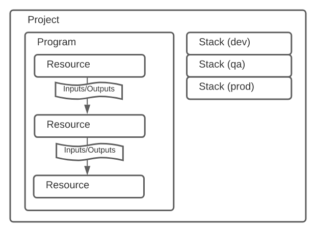

# Pulumi 프로젝트의 구성

---


Pulumi는 폴더 단위의 프로젝트로 구성돼 있다. `aws-python` 템플릿의 경우, 기본적인 폴더의 구조는 다음과 같다.

```yaml
.
├── Pulumi.dev.yaml
├── Pulumi.yaml
├── __main__.py
├── requirements.txt
└── venv
```

- `Pulumi.yaml` : 프로젝트 정의

```yaml
name: test
runtime: python
description: A minimal AWS Python Pulumi program
```

- `Pulumi.{stack_name}.yaml` : 스택 정의. 각 스택마다 서로 다른 정의를 사용할 수 있다.

```yaml
config:
  aws:region: us-east-1
```

`config` 를 코드에서 사용하려면 다음과 같다.

```python
config = pulumi.Config();
name = config.require('name');
lucky = config.get_int('lucky') or 42
print(f'Hello, {name} -- I see your lucky number is {lucky}!')
```

- `__main__.py` : 스택 리소스 정의

```python
"""An AWS Python Pulumi program"""

import pulumi
from pulumi_aws import s3

# Create an AWS resource (S3 Bucket)
bucket = s3.Bucket('my-bucket')

# Export the name of the bucket
pulumi.export('bucket_name', bucket.id)
```

## 프로젝트

- 깃허브 레포와 비슷한 개념으로, 소스코드와 메타데이터를 모아놓은 디렉터리다.

## 프로그램

- 프로그래밍 언어로 작성되는 클라우드 인프라의 구조다.
- 리소스 객체를 인프라에 할당해서 사용한다.
- 프로그램 작성이 끝나면 Plumi CLI를 사용해 인프라를 비교하고 배포할 수 있다.

## 스택

- 프로젝트의 인스턴스와 같은 개념으로 서로 분리된 구성을 가지고 있다.

ex) 프로젝트 `foo` 는 서로 다른 개발 환경을 가지고 있는 `dev`, `test`, `prod` 와 같은 스택을 가질수 있다.

- 서로 다른 클라우드 공급자(AWS 같은거 ) 로 구성되거나 리전이 다른 경우도 포함

## 예시
```python
import pulumi
import pulumi_aws as aws

group = aws.ec2.SecurityGroup('web-sg',
    description='Enable HTTP access',
    ingress=[
        { 'protocol': 'tcp', 'from_port': 80, 'to_port': 80, 'cidr_blocks': ['0.0.0.0/0'] }
    ])

server = aws.ec2.Instance('web-server',
    ami='ami-6869aa05',
    instance_type='t2.micro',
    vpc_security_group_ids=[group.name] # reference the security group resource above
)

pulumi.export('public_ip', server.public_ip)
pulumi.export('public_dns', server.public_dns)
```