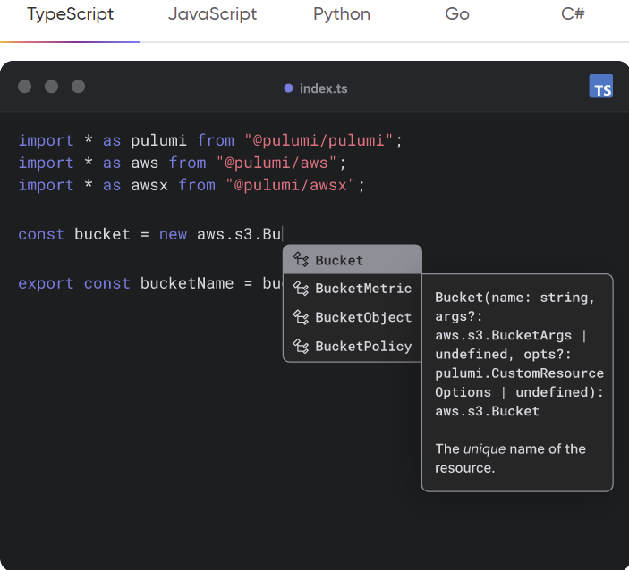
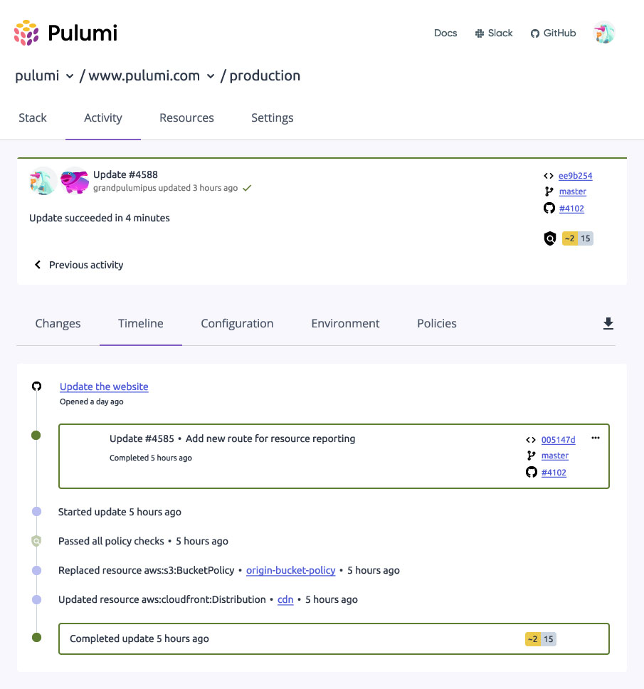

# Pulumi란?

---

`Infrastructure as Code`(Iac) “플랫폼" 이다.

Pulumi SDK 뿐만 아니라 웹 대시보드와 같은 부가적인 기능이 있다.

`Pulumi`가 요즘 뜨고 있는 이유는 다양한 언어를 가지고 laC 구현이 가능하다는 점 때문이다.

`Terraform`과 같이 `Terraform` 전용 언어를 사용해지 않아도 되기 때문이다. 현재 `Pulumi`에서 지원하는 언어는 다음과 같다.

### 지원하는 언어

- TypeScript
- JavaScript
- Python
- Go
- .NET

laC에서 중요한 점은 클라우드 플랫폼에 대한 지원 여부와 확장성인데, Pulumi는 여러 플랫폼을 지원 하고 있다

### 지원 플랫폼

- AWS
- Google Cloud Platform(GCP)
- Azure
- Kubernetes

K8s가 최근 플랫폼으로 급격히 성장중에 있어 Plumi가 K8s를 지원 한다는 점은 큰 장점으로 작용 할거라 본다.

## Build

익숙한 프로그래밍 언어 및 도구의 성능과 인프라의 안정성과 코드로서의 신뢰성을 결합하여 클라우드애플리케이셔 및 인프라를 구축합니다.

- 유연성과 표현력
    - 루프, 조건, 힘수, 클래스 등이 있다
- 생산성을 발휘합니다.
    - 몇 시간이 아니라 몇 포 만에 완료됩니다.
- 공유 및 재사용
    - 보일러 플레이트를 줄이기 위한 패턴 및 관행을 저의 하고 사용합니다.

## Deploy

전체 팀이 1일 이상 사용할 수 있는 단잉 공유 접근 방식을 사용하여 클라우드 애플리케이션 및 인프라를 더 바르고 안정적으로 구현합니다.

- 인프라와 애플리케이션 통합
    - 전체 클라우드 소프트웨어 스택을 통합한다
- 검증
    - 테스트 및 기본 제공 정책을 통해 모든 변경 사항을 검증
- 전 세계 제공 자동화
    - 서장에 따라 고급 자동화를 통해 제공 범위를 확장 가능

## Manage

팀이 협헙, 가시성, 정책 및 제어를 통해 클라우드 엔지니어링을 채택할 수 있도록 지원하는 공유 플랫폼을 통해 클라우드 애플리케이션 및 인프라를 관리

- 기본적인 보안, 비밀 및 상태에 대해 자동으로 암호화.
- 가드레일을 사용해 안정성을 높임
    - 아이덴티티와 코들서의 정책 추가로 지속적인 구정 준수 보장
- 누가, 무엇을, 언제 바꿨는지 확인할 수 있고, 팀 전체에 걸쳐 가시성 및 감사를 완벽하게 변경 가능

### Multiple deployment Options

Pulumi의 Automation Api 를 사용하여 CI/CD 프로세스를 통해 CLI 상호 작용적으로 인프라를 구축

### Deployments ad Code

Automaiton Api를 사용하여 애플리케이션 코드에서 런타임에 배포를 실행.

### Preview and test changes

표준 단위 테스트를 프레임워크 및 통합 테스트를 통해 인프라를 테스트라고 검증