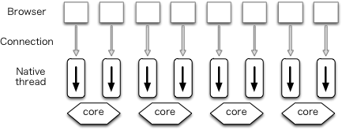
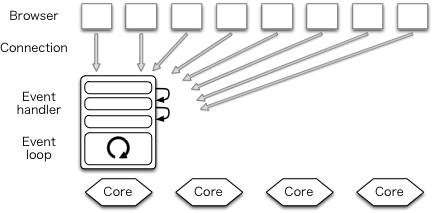

# Apache 서버와 다른 점

---

Apache와 같은 웹서버는 클라이언트로 부터 받은 요청을 처리할 때 새로운 프로세스 또는 쓰레드를 생성하여 처리.

요청마다 쓰레드가 생성되므로 접송하는 사용자가 많으면 그만큼 쓰레드가 생성되어 CPU와 메모리 자원의 소모가 커진다

> `쓰레드` :
>
>
> [쓰레드(Thread) 란 무엇인가?](https://www.notion.so/Thread-1c1c254386ad4b67bba1d535b62d8fce)
>

`Event-Driven` 구조로 동작하기 때문에 한 개 또는 고정된 프로세스만 생성하여 사용, 비동기 방식으로 요청들을 Concurreney 하게 처리할 수 있다.

그림 보면 여러 요청 들어와도 프로세스 하나 가지고 처리 하기 때문에 프로세스 생성 하는데 비용이 안 들어도 된다 적은 비용으로 운용 가능

## 아파치와의 관계

> 아파치는 1996년 부터 단 한번도 1등을 놓친적 없을 정도로, 사랑받는 웹서버 이다.
>
>
> 하지만 오래된 만큼 신기술에 호환되지 않는 경우도 있을 수 있다.
>

> 현재 국내에선 아파치와 nginx 모두 많이 사용되고 있고, 분포는 아래와 같다
>
>
> 
>
> 참고로 apache는 오래된만큼 안정성이 매우 뛰어나고, nginx는 속도면에서 apache보다 빠르다.
>