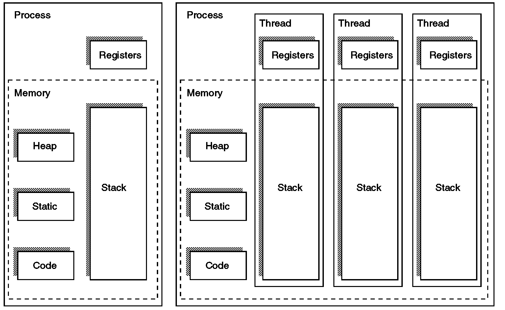

# 쓰레드(Thread) 란 무엇인가?

---

- 쓰레드란 프로그램(프로세스) 실행의 단위
    - 하나의 프로세스는 여러개의 쓰레드로 구성 가능

- 하나의 프로세스를 구성하는 쓰레드들은 프로세스에 할당된 메모리, 자원등을 공유

- 프로세스와 같이 실행, 준비, 대기 등의 실행 상태를 가진다
    - 실행 상태가 변할때마다 쓰레드 문맥교환(context switching) 을 수행한다.

- 각 쓰레드별로 자신만의 `스택`과 `레지스터`를 간진다.

## 프로세스와 쓰레드의 차이

---

> 프로세스는 운영체제로부터 자원을 할당받는 작업의 단위이고 쓰레드는 프로세스가 할당받은 자원을 이용하는 실행의 단위이다.
>

### `프로세스`

- 프로세스는 `실행 중인 프로그램`으로 디스크로부터 메모리에 적재되어 CPU의 할당을 받을 수 있다
    - 프로세스 생성은 많은 시간과 자원을 소비한다.

### `쓰레드`

- 쓰레드는 `프로세스`의 `실행 단위`라고 할 수있다.
- 한 프로세스 내에서 동작되는 여러 실행 흐름으로 프로세스 내의 주소 공간이나 자원을 공유할 수 있다.

- 이 경우 각각의 쓰레드는 `독립적인 작업`을 수행해야 하기 때문에 각자의 `스택`과 `PC 레지스터 값`을 가지고 있다.