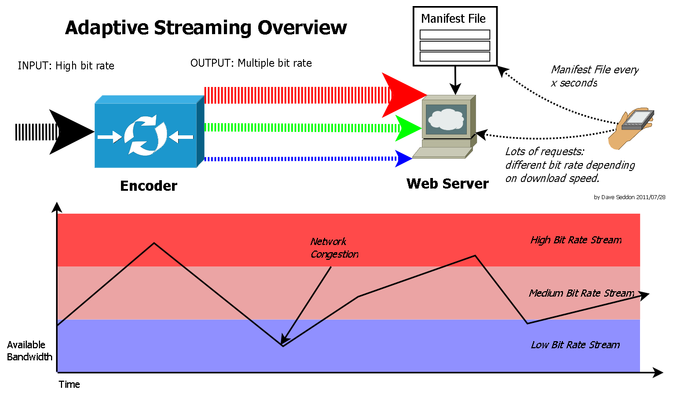

# 적응 비트레이트 스트리밍(Adaptive Streaming)

---

## 이건 뭘까?

---

네트워크 상태 혹은 전송 상태 또는 cpu상태를 바탕으로 대역폭이 소화할 수 있는 정도의 고화질의 부분 콘텐츠를  전송 하는 방식을 이야기 한다.

또 낮은 전송 상태 , 네트워크 상태가 된다면 낮은 비트레이트 상태로 변경 하여 전송 하는 민첩함을 가졌다.

적응 비트레이트 스트리밍을 하기 위해서는 컨텐츠를 다양한 비트레이트로 인코딩 하는 과정이 있어야 한다. 파일 하나를 여러 파일로 인코딩 하고 가변한 파일을 2~10초 단위로 부분 동영상으로 나누어 저장한다.

사용자는 메니페스트(Manifest) 라는 파일을 받게 되고 이 파일이 담고 있는 비트레이트의 종류, 부분 파일의 식별 방법에 따라 적절한 파일을 HTTP 로 요청하여 받게 돤다.