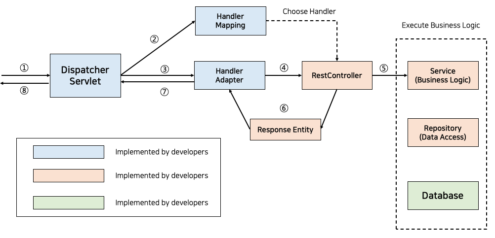
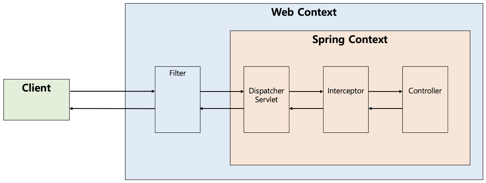

# Dispatcher-Servlet?

---

## 1. 개념

HTTP 프로토콜로 들어오는 모든 요청을 가장 먼저 받아 적합한 컨트롤러에 위임해주는 프론트 컨트롤러(Front Controller)

## 2. 장점

dispatcher-servlet이 해당 어플리케이션으로 들어오는 모든 요청을 핸들링해주고 공통 작업을 처리

## 3. 단점

모든 요청을 처리하다보니 이미지나 HTML/CSS/JavaScript 등과 같은 정적 파일에 대한 요청마저 모두 가로채는 까닭에 정적자원(Static Resources)을 불러오지 못하는 상황도 발생하곤 했습니다. 이러한 문제를 해결하기 위해 개발자들은 2가지 방법을 고안했습니다.

### 해결방안

- 정적 자원에 대한 요청과 어플리케이션에 대한 요청을 분리
- 어플리케이션에 대한 요청을 탐색하고 없으면 정적 자원에 대한 요청으로 처리

---

## 동작 방식

적합한 컨트롤러와 메소드를 찾아 요청을 위임해야 한다.

1. 클라이언트의 요청을 디스패처 서블릿이 받음
2. 요청 정보를 통해 요청을 위임할 컨트롤러를 찾음
3. 요청을 컨트롤러로 위임할 핸들러 어댑터를 찾아서 전달함
4. 핸들러 어댑터가 컨트롤러로 요청을 위임함
5. 비지니스 로직을 처리함
6. 컨트롤러가 반환값을 반환함
7. HandlerAdapter가 반환값을 처리함
8. 서버의 응답을 클라이언트로 반환함

### **1. 클라이언트 요청을 디스패처 서블릿이 받음**

서블릿 컨텍스트(웹 컨텍스트) 에서 필터들을 지나 스프링 컨텍스트에서 디스패처 서블릿이 가장 먼저 요청을 받게 된다.

### 2. 요청 정보를 통해 요청을 위임할 컨트롤러를 찾음

`HandlerMapping`의 구현체 중 하나인 `RequestMappingHandlerMapping`은 모든 컨트롤러 빈을 파싱하여 `HashMap`으로 (요청 정보, 요청을 처리할 대상)을 관리합니다

`HadlerMapping`은 요청이 오면 Http Method, URI 등을 사용해 요청 정보를 객체로 만들고, Map의 Key로 사용해 요청을 처리할 `HandlerMethod`를 찾고 `HandlerMethodExecutionChain`으로 감싸서 반환합니다.

`HandlerMethodExecutionChain` 으로 감싸서 반환 하는 이유는 컨트롤러로 요청을 넘겨주기 전에 처리 해야 하는 인터셉터 등을 포함하기 위해서.

### 3. 요청을 컨트롤러로 위임할 핸들러 어댑터를 찾아서 전달함

디스패처 서블릿은 컨트롤러로 직접 위임 하는것이 아니라 `handler Adapter`를 통해 컨틀롤러로 위임한다.

- Adapter를 통해 호출 하는 이유 : 공통적인 전/ 후 처리 과정이 필요하기 때문
    - `@RequestParam`, `@RequestBody` 등을 처리하기 위한 `ArgumentResolver`들과 응답 시에 `ResponseEntity`의 Body를 Json으로 직렬화하는 `ReturnValueHandler`들이 어댑터를 통해 처리됩니다.

### ****4. 핸들러 어댑터가 컨트롤러로 요청을 위임함****

요청을 처리할 대상 정보인 `HandlerMethod` 객체에는 컨트롤러 정보와 메소드 객체가 있으므로 리플렉션의 메소드 객체를 invoke 합니다.

### **5. 비지니스 로직을 처리함**

이후에 컨트롤러는 서비스를 호출하고 비지니스 로직들이 진행됩니다.

### 6. 컨트롤러가 반환값을 반환함

비즈니스 로직이 처리된 후에는 컨트롤러가 반환값을 반환합니다. 요즘 프론트엔드와 백엔드를 분리하고, `MSA`로 가고 있는 시대에서는 주로 `ResponseEntity`를 반환한다.

### ****7. HandlerAdapter가 반환값을 처리함****

`HandlerAdapter`는 컨트롤러로부터 받은 응답을 `ReturnValueHandler`를 통해 후처리한 후에 디스패처 서블릿으로 돌려줍니다.

### **8. 서버의 응답을 클라이언트로 반환함**

디스패처 서블릿을 통해 반환되는 응답은 다시 필터들을 거쳐 클라이언트에게 반환됩니다.