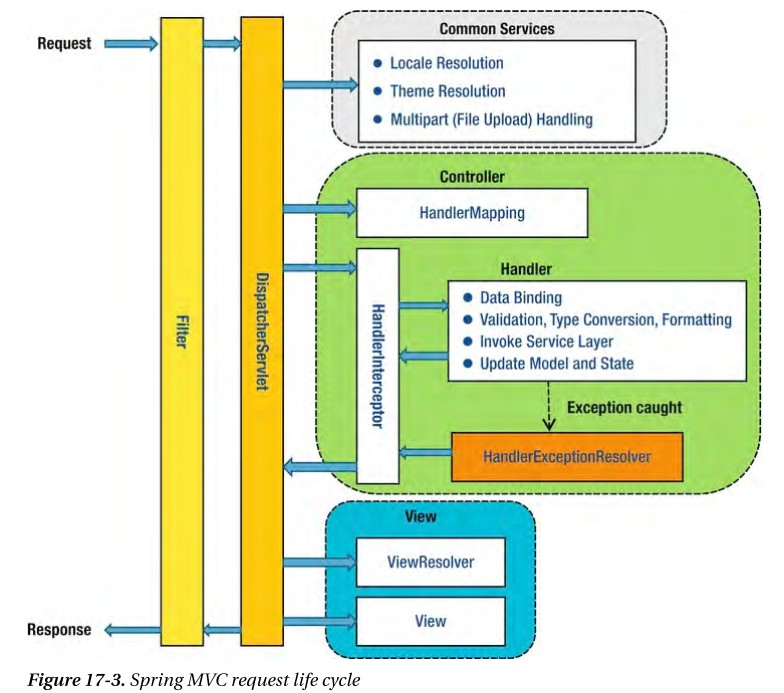

# DispatcherServlet 내에서 발생한 예외

## ****DispatcherServlet 내에서 발생한 예외****

---

`DispatcherServlet` 내에서 발생하는 예외는 `HandlerExceptionResolver`를 사용한 예외 전략으로 내부에서 자체적으로 해결할 수 있다.

### 예외(Exception) 처리는 어떻게??

---

1. Contorller 레벨에서 처리
2. Global 레벨에서 처리
3. HandlerExceptionResolver를 이용한 처리

### Controller 레벨에서 처리

---

Spring에서는 Controller에서 발생한 예외에 대해 Common하게 처리 할 수 있는 기능을 제공한다.

```java
package com.example.springstudy.demo2.controller;

import com.example.springstudy.demo2.exception.DemoException;
import com.example.springstudy.demo2.exception.FilterException;
import com.example.springstudy.demo2.exception.InterceptorException;
import lombok.extern.slf4j.Slf4j;
import org.springframework.stereotype.Controller;
import org.springframework.web.bind.annotation.ExceptionHandler;
import org.springframework.web.bind.annotation.GetMapping;

@Slf4j
@Controller
public class DemoController {

    @GetMapping("/exception/demo")
    public String occurDemoException() {
        //강제로 DemoException을 발생 시켜 보았다.
        throw new DemoException(); //occur DemoException (RuntimeException)
    }
    
    @GetMapping("/exception/demo2")
    public String occurDemoException2() {
        //강제로 DemoException을 발생 시켜 보았다.
        throw new DemoException(); //occur DemoException (RuntimeException)
    }

    @ExceptionHandler(DemoException.class)
    public String handleDemoException(DemoException e) {
        log.error(e.getMessage());
        return "/error/404";
    }
}
```

`DemonController`내에서 발생한 `DemonExcepion`에 대해서는 `handleDemoException` 메소드에서 모두 처리를 해준다.

- Controller 메소드 내의 하위 서비스에서 Checked Exception이 발생하더라도, Controller 메소드 상위까지 예외를 throw 시키면 `@ExceptionHandler` 어노테이션을 사용하여 Controller 전역적으로 예외처리가 가능
- Controller 메소드 내의 하위 서비스에서 `Runtime Exception`이 발생하면, 서비스를 호출한 최상위 Controller에서 해당 예외를 처리 해줌

## Global 레벨에서의 처리

위의 방식처럼 Controller 별로 @ExcpetionHandler 어노테이션이 붙은 메소드를 만들게 된다면, 중복코드가 양산될 것이고 결국 유지보수의 비용이 증가.

ex) 한 서비스에서 무조건 한 `Exception`만 뜬다. (`Exception`이 터지는지 모름)

- `@ControllerAdvice` - Expcetion 처리 후 Error Page등을 통해 처리가 가능
- `@RestControllerAdvice`
    - REST API에 대한 Exception 처리 등에 용이. (Default 데이터를 리턴 해줄수 있음)
    - `@RestControllerAdvice` = @ControllerAdvice + @ResponseBody

저거 두개로 Web Application 전역적으로 @ExceptionHandler를 사용할 수 있다.

### 주의!) @ControllerAdvice로 케어 가능한 범위는 Dispatcher Servlet 내에서 이루어진다

```java
import com.example.springstudy.demo2.exception.DemoException;
import com.example.springstudy.demo2.exception.FilterException;
import com.example.springstudy.demo2.exception.InterceptorException;
import lombok.extern.slf4j.Slf4j;
import org.springframework.web.bind.annotation.ControllerAdvice;
import org.springframework.web.bind.annotation.ExceptionHandler;

@Slf4j
@ControllerAdvice
public class DemoControllerAdvisor {

    //모든 Controller에서 일어나는 DemoException에 대해 전역적으로 예외처리
    @ExceptionHandler(DemoException.class)
    public String handleDemoExceptionForGlobal(DemoException e) {
        log.error(e.getMessage());
        return "/error/404";
    }
}
```

**@Controller내의 @ExceptionHandler로 예외처리를 하게 되면 거기서 예외처리가 끝난다.**

**더 상위로 Exception을 throw하더라도 `@ControllerAdvice의 @ExceptionHandler`에서 예외처리를 하지 않는다.**

## ****HandlerExceptionResolver를 이용한 처리****

---

> HandlerExceptionResolver는 Controller의 작업 중에 발생한 예외를 어떨게 처리 할 지에 대한 전략 이다
>

`DispatcherServlet이외의 영역에서 발생한 에러는 Servlet Container 내부에서 처리 될 것`이다. 만약 error-page라도 잘 정의 했다면은 다행이겠지만, 그렇지 않다면 브라우져 화면에서 404, 500과 같은 에러 메세지를 표현 할 것이다.

(Spring boot의 경우 default로 white label page가 에러페이지로 설정 되어있다.)

HandlerExceptionResolver는 아래와 같은 인터페이스를 제공한다.

```java
package org.springframework.web.servlet;

import javax.servlet.http.HttpServletRequest;
import javax.servlet.http.HttpServletResponse;
import org.springframework.lang.Nullable;

public interface HandlerExceptionResolver {
    @Nullable
    ModelAndView resolveException(HttpServletRequest var1, HttpServletResponse var2, 
																		@Nullable Object var3, Exception var4);
}
```

DispatcherServlet 내에서 예외 발생 시, resolverException 메소드를 구현한 HandlerExceptionResolver들이 실행 계획에 따라 처리 되며 예외를 처리 하게 된다.

`DispatcherServlet` 에 기본적으로 3개의 HandlerExceptionResolver가 등록되어 있다.

1. ExceptionHandlerExceptionResolver
2. ResponseStatusExceptionResolver
3. DefaultHandlerExceptionResolver

수능로 Resolver가 실행된다.

### ExceptionHandlerExceptionResolver

---

Deprecated처리 되어 ExceptionHandlerExceptionResolve 클래스를 사용하고 있다.

위에서 사용한 `@ExceptionHandler` 어노테이션에 대한 Resolver 클래스이다.

### **ResponseStatusExceptionResolver**

---

ResponseStatusExceptionResolver는 예외에 대한 Http 응답을 설정해 줄 수 있다.특정 예외가 발생하였을 때 , 단순히 500 (internal-server-error) 대신 더 구체적인 응답 상태값을 전달 해 줄 수 있다.

사용 예제 (@ExceptionHandler와 함께 사용

```java
package com.walkhub.walkhub.global.exception;

import com.walkhub.walkhub.global.error.exception.ErrorCode;
import com.walkhub.walkhub.global.error.exception.WalkhubException;

public class CredentialsNotFoundException extends WalkhubException {

    public static final WalkhubException EXCEPTION =
            new CredentialsNotFoundException();

    private CredentialsNotFoundException() {
        super(ErrorCode.CREDENTIALS_NOT_FOUND);
    }

}
```

Json 형태로 보내줄수 있음 이런 형식으로 만들면

### ****DefaultHandlerExceptionResolver****

---

DispatcherServlet에 디폴트로 등록 된 3가지 HandlerExceptionResolver에서 예외처리를 하지 못하는 경우, 마지막으로 `DefaultHandlerExceptionResolver`에서 예외처리를 해준다.

DefaultHandlerExceptionResolver에서는 내부적으로 Spring 표준 예외처리를 해준다.각 상황에 걸맞는 응답 코드를 리턴해 주는 역할을 한다.

- Request URL에 맞는 Controller를 못찾는 경우 ==> 404 Not Found
- Controller 메소드 실행 중 예외가 발생하는 경우 ==> 500 Internal Server error
- Controller의 파라미터 형식이 잘못된 경우 ==> 400 Bad Request

---

# Spring MVC

---


진짜 정말 앵간하면 Spring MVC의 대한 Exception 처리는 99%가 `Despatcher Servlet`에서 일어난다.

그렇기 때문에 Dispatcher Servlet 내부에서 발생한 Exception은 Dispatcher Servlet 내부에서 자체적으로 해결이 가능하다.