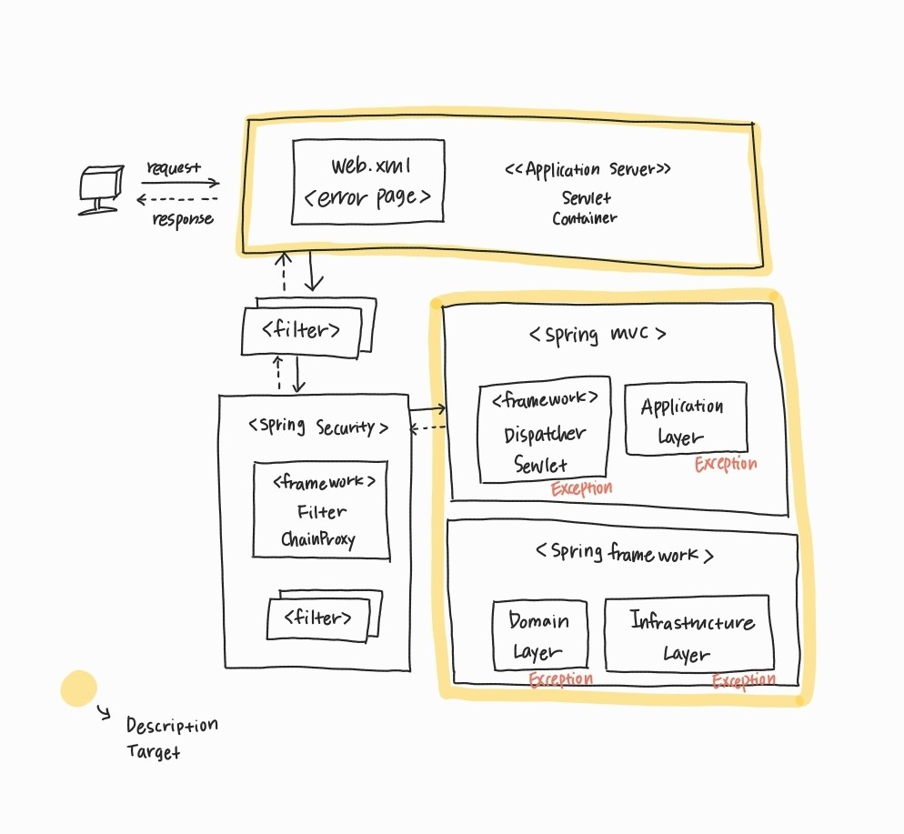

# 스프링 예외 발생 위치와 처리 방법

---

스프링의 처리 과정을 보면 예외가 발생하는 부분은 크게 두 가지로 나눌 수 있다.

1. `DispatcherServlet` 내에서 발생하는 예외 (Controller, Service, Repository 등)
2. `DispatcherServlet` 전의 서블릿(Filter)에서 발생하는 예외

[Dispatcher-Servlet?](https://www.notion.so/Dispatcher-Servlet-497d3d0d4629441e8d3a66f390c4d09e)

[****DispatcherServlet 내에서 발생한 예외****](%E1%84%89%E1%85%B3%E1%84%91%E1%85%B3%E1%84%85%E1%85%B5%E1%86%BC%20%E1%84%8B%E1%85%A8%20ddbfe/Dispatcher%208bd49.md)

[****DispatchherServlet 전에 발생한 예외 (Filter 에서 터진 에러)****](%E1%84%89%E1%85%B3%E1%84%91%E1%85%B3%E1%84%85%E1%85%B5%E1%86%BC%20%E1%84%8B%E1%85%A8%20ddbfe/Dispatchhe%20a97c5.md)

[****HandlerExceptionResolver의 예외 처리 방법****](%E1%84%89%E1%85%B3%E1%84%91%E1%85%B3%E1%84%85%E1%85%B5%E1%86%BC%20%E1%84%8B%E1%85%A8%20ddbfe/HandlerExc%20847dc.md)