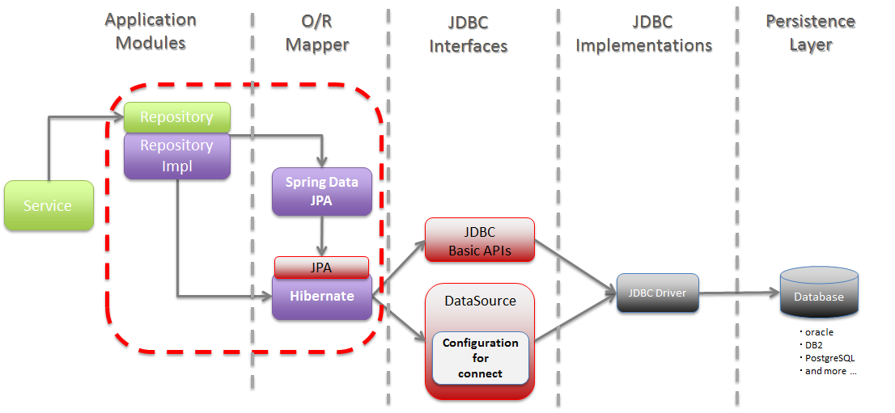

- 자바 ORM 기술에 대한 표준 명세, `JAVA` 에서 제공하는 API 이다.
- 자밥 어플리케이션에서 괸계형 데이터베이스를 사용하는  방식을 정의한 인터페이스 이다.
    - Spring PSA에 의해서 (POJO를 사용하면서 특정 기술을 사용하기 위해서) 표준 인터페이스를 정해두었다. 그중 ORM을 사용하기 위해 만든 인터페이스다
- 기존 EJB에서 제공되던 엔티티 빈을 대체하는 기술이다.
- ORM이기 때문에 자바 클래스와 DB테이블을 매핑한다(sql을 매핑하지 않는다)