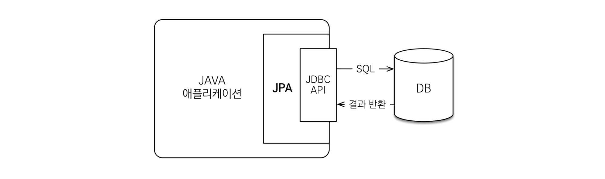
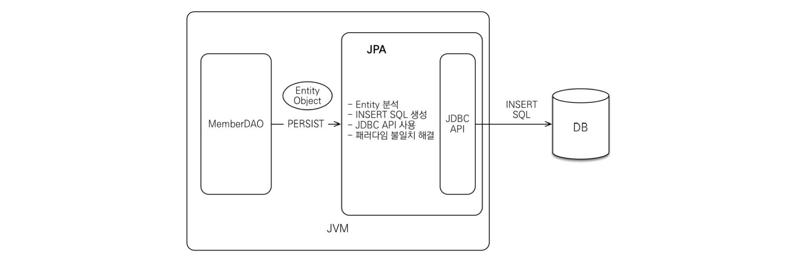
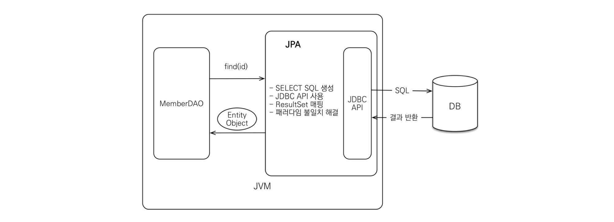

# JPA 동작 과정

---

JPA는 애플리케이션과 JDBC 사이에서 동작 한다.

**개발자가 JPA를 사용하면, JPA 내부에서 JDBC API를 사용하여 SQL을 호출하여 DB와 통신한다.**

## insert

MemberDAO 에서 객체를 저장하고 싶을 때 개발자는 JPA에 Member 객체를 넘긴다.

JPA는

1. Member 엔티티를 분석한다.
2. INSET SQd을 생성한다.
3. JDBC API를 사용하여 SQL을 DB에 날린다.

## find

개발자는 member의 pk 값을 JPA에 넘긴다.

JPA는

1. 엔티티의 매핑 정보를 바탕으로 적절한 SELECT SQL을 생성한다.
2. JDBC API를 사용하여 SQL을 DB에 날린다.
3. DB로 부터 결과를 받아온다.
4. 결과(ResultSet)를 객체에 모두 매핑한다.

   쿼리를 JPA가 만들어 주기 때문에 Object와 RDB 간의 패러다임 불일치를 해결할수 있다.

   [패러다임 불일치](JPA%20%E1%84%83%E1%85%A9%E1%86%BC%E1%84%8C%E1%85%A1%E1%86%A8%20%E1%84%80%E1%85%AA%E1%84%8C%E1%85%A5%E1%86%BC%20894df77016a044d8a52f775329c3165c/%E1%84%91%E1%85%A2%E1%84%85%E1%85%A5%E1%84%83%E1%85%A1%E1%84%8B%E1%85%B5%E1%86%B7%20%E1%84%87%E1%85%AE%E1%86%AF%E1%84%8B%E1%85%B5%E1%86%AF%E1%84%8E%E1%85%B5%20d8c7fd11a88d4476bc8b3bc3c2ab339f.md)