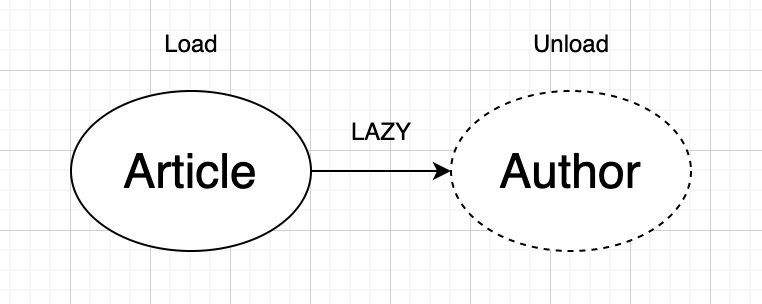
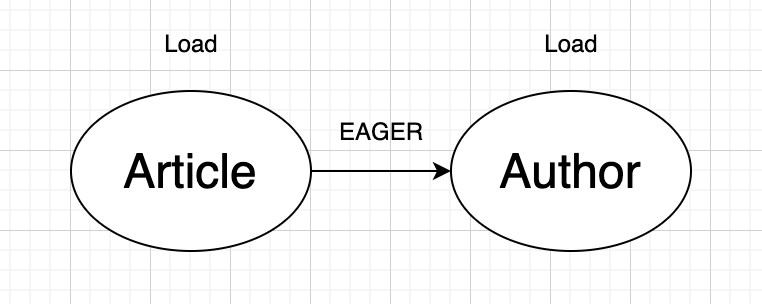

# JPA는 왜 지연 로딩을 사용할까?1

---

## Fetch Type 이란?

---

`JPA`에서 테이블 간 연과 관계는 객체의 참조를 통해 이루어 진다.

서비스가 커질수록, 참조하는 객체가 많아지고, 객체가 가지는 데이터는 많아져 객체들의 데이터를 한번에 가져오는 행동은 `부담이 매우 커진다.`

그래서 JPA는 참조하는 객체들의 데이터를 가져오는 시점을 정할수 있다. 이걸 **Fetch Type** 이라 한다.

## LAZY(게을러)

- 참조 객체들의 데이터들은 무시하고 해당 엔티티의 데이터만을 가져온다.

### 이래도 LAZY?

- `EAGER`의 장점에도 `Fetch Type`은 항상 Lazy를 써야 하는게 맞다.
- `Fetch Type`이 `EAGER`인 경우, 엔티티 대한 데이터를 모두 가져와야 하기 때문에 그 결과 단순한 조회 쿼리 하나가 지나치게 많은 쿼리문을 수행하게 되어 성능 저하를 유발할 수 있습니다.

## EAGER(성실함)

- 하나의 객체를 DB로 부터 읽어올 때 참조 객체들의 데이터까지 전부 읽어오는 방식.

### **EAGER의 장점?**

- 언제나 한 번의 쿼리로 모든 정보를 가져온다.
    - 참조 객체와 항상 함께 로드되어야 하는 조건을 가진 엔티티는 `LAZY` 보단 `EAGER`

[JPA는 왜 지연 로딩을 사용할까?](https://velog.io/@bread_dd/JPA%EB%8A%94-%EC%99%9C-%EC%A7%80%EC%97%B0-%EB%A1%9C%EB%94%A9%EC%9D%84-%EC%82%AC%EC%9A%A9%ED%95%A0%EA%B9%8C)