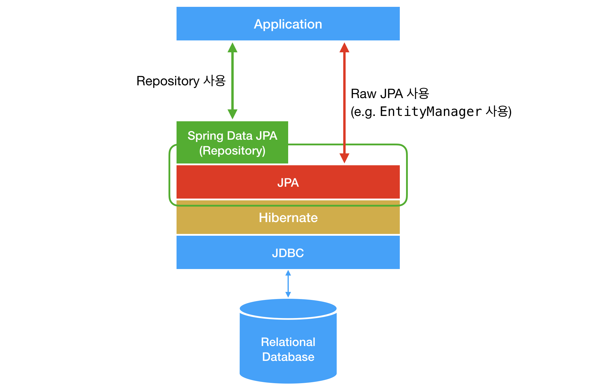

# Spring-Data-Jpa

---

JPA은 ORM을 위한 자바 EE 표준이며 Spring-Data-JPA는 JPA를 쉽게 사용하기 위해 스프링에서 제공하고 있는 프레임워크이다.

추상화 정도는 `Spring-Data-JPA -> Hibernate -> JPA` 이다.

Hibernate를 쓰는 것과 Spring Data JPA를 쓰는 것 사이에는 큰 차이가 없지만

- 구현체 교체의 용이성
- 저장소 교체의 용이성