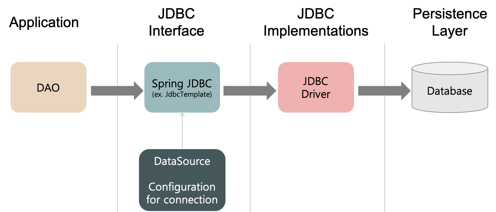

# 🤔ORM이 뭐죠? SQL Mapper와 ORM

---

## **🤔ORM이 뭐죠? SQL Mapper와 ORM**

---

### jpa와 jdbc의 차이점

- ORM은 DB 테이블을 자바 객체로 매핑함으로써 객체간의 관계를 바탕으로 SQL을 자동으로 생성 하지만 Mapper는 SQL을 명시를 해줘야 한다.
- ORM은 RDB의 관계를 Object에 반영 하는 것이 목적이라면, Mapper는 단순히 필드를 매핑시키는것이 목적이라는 점에 차이가 있다.

### SQL Mapper

- `SQL` ← mapping → Object 필드.
- SQL 문으로 직접 디비를 조작한다.
- Mybatis, jdbc Template

### **ORM(Object-Relation Mapping/객체-관계 매핑)**

- DB 데이터 ← mapping → Object필드.
    - 개게를 통해 간접적으로 디비 데이터를 다룬다.
- 객체와 디비의 데이터를 자동으로 매핑해준다.
    - SQL 쿼리가 아니라 메서드로 데이터를 조작할 수 있다.
    - 객체간 관계를 바탕으로 sql을 자동으로 생성한다.
- Persistant API 라고 할 수 있다.
- JPA, Hibernate

### JDBC

JDBC는 DB에 접근할 수 있도록 자바에서 제공하는 API 이다.

모든 JAVA Acess 기술의 근간이다. ⇒ 모든 Persistance Framework는 내부적으로 JDBC API를 사용한다.