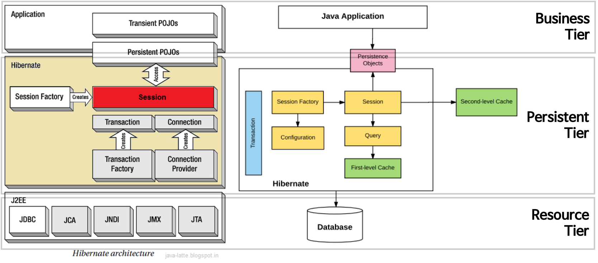

# JPA 하이버네이트

---

하이버네이트는 JPA 구현체의 한 종류이다.

JPA는 DB와 객체를 매핑학 위한 인터페이스(API)를 제공하고 JPA 구현체(하이버네이트)는 인터페이스를 구현한 것이다.

- Hibernate가 SQl을 직접 사용하지 않는다 해서 JDBC API를 사용하지 않는다는것은 아니다.
    - Hibernate 가 지원 하는 메서드 내부에서 JDBC API가 동작하고 있으며, 단지 개발자가 직접 SQL을 직접 작성하지 않을 뿐이다.

- HQL(Hibernate Query Language)이라 불리는 매루 강력한 쿼리 언어를 포함하고 있다.
    - HQL은 SQL과 매우 비슷하며 추가적인 컨벤션을 정의할 수도 있다.
    - HQL은 완전히 객체 지향적이며 이로써 상속, 다향성, 관계등의 객체지향의 감점이 있다.
    - HQL은 쿼리 결과로 객체를 반환하며 프로그래머에 의해 생성 삭제 접근이 가능하다.
    - HQL은 SQL에서는 지원하지 않는 `페이지네이션이나` 동적 `프로파일링` 같은 기능을 제공
    - HQL은 여러 테이블을 작업할 때 명시적인 join을 요구하지 않는다.