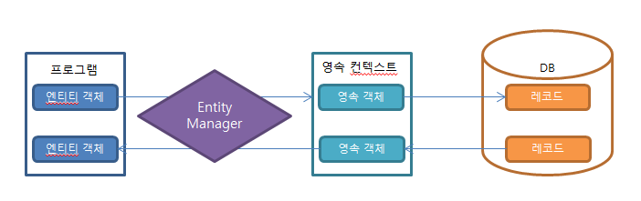

# JPA에서 영속성

---

JPA에서 가장 중요한 내용은 엔티티가 `영속성 컨텍스트`에 포함이 되어있느냐 아니냐 로 갈린다.

JPA의 엔티티 메니저가 활성화된 상태로 트랜잭션(@Transactional) 안에서 DB에서 데이터를 가져오면 이 데이터는 영속성 컨텍스트가 유지된 상태이다.

이 상태에서 해당 데이터 값을 변경하면 **트랜잭션이 끝나는 시적에 해당 테이블에 변경 내용을 반영하게 된다.**

따라서 우리는 엔티티 객체의 필드 값만 변경해주면 별도로 update() 쿼리를 날릴필요가 없게 된다

이 개념을 `더티 체킹` 이라 한다

[Dirty Checking](https://github.com/lyutvs/Muttukttung-gamjachip/blob/main/spring%20boot/jpa/%ED%84%B0%ED%8B%B0%20%EC%B2%B4%ED%82%B9.md)

> `Spring Data Jpa` 를 사용하면 기본으로 엔티티 메니저가 활성화 되어 있는 상태이다.
>

> `연속성 컨텍스트` : 영속성 컨텍스트는 직접 접근이 불가능 하고 Entity Manager를 통해서만 접근 가능 하다
> 