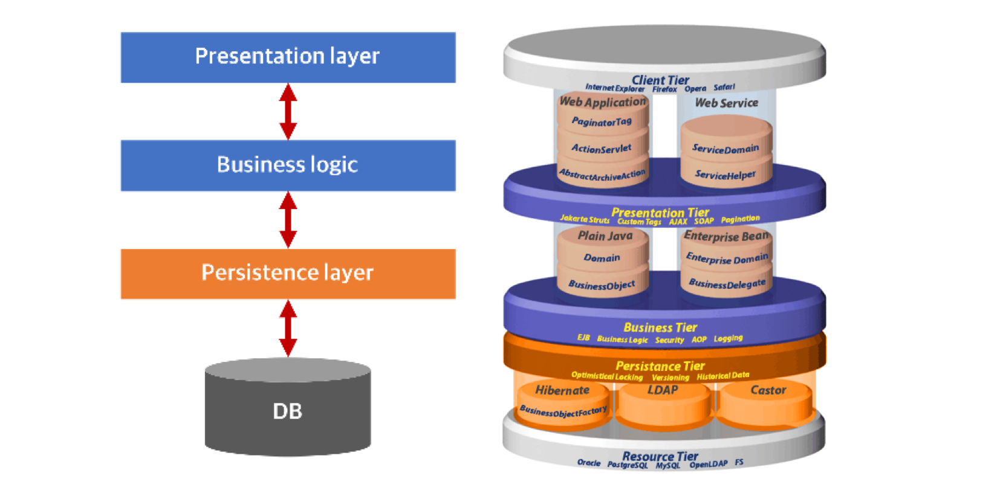

# 영속성

---

### 데이터를 생성한 프로그램이 종료되어도 사라지지 않는 데이터의 특성을 말한다.

영속성을 갖지 않으면 데이터는 메모리에서만 존재하게 되고 프로그램이 종료되면 해당 데이터는 모두 사라지게 된다.

그래서 우리는 데이터를 파일이나 DB에 영구 저장함으로써 데이터에 영속성을 부여한다.

## Persistance Layer

프로그램의 아키텍쳐에서 데이터에 영속성을 부여해주는 계층이다.

JDBC를 이용해 직접 구현이 가능하나 보통은 Persistance Framework를 사용한다.

> 프레젠테이션 계층 (Presentation layer) - UI 계층 (UI layer)
>

> 함애플리케이션 계층 (Application layer) - 서비스 계층 (Service layer)
>

> 함비즈니스 논리 계층 (Business logic layer) - 도메인 계층 (Domain layer)
>

> 함데이터 접근 계층 (Data access layer) - 영속 계층 (Persistence layer)
>